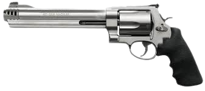

<!DOCTYPE html>
<html lang="vi">
<head>
  <meta charset="UTF-8">
  <meta name="viewport" content="width=device-width, initial-scale=1.0, maximum-scale=1.0">
  <title>Trò Chơi Súng Lục – Xoay Chuẩn + Màn Hình Ngang</title>
  
</head>
<body>
  

    
    

      <button onclick="spinCylinder()">🌀 Xoay ổ</button>
      <button onclick="toggleCylinderView()">🔄 Nạp đạn</button>
    

  

  

  <audio id="sfx-load" src="assets/reload.mp3"></audio>
  <audio id="sfx-spin" src="assets/spin.mp3"></audio>
  <audio id="sfx-fire" src="assets/gunshot.mp3"></audio>
  <audio id="sfx-click" src="assets/click.mp3"></audio>

  
</body>
</html>
